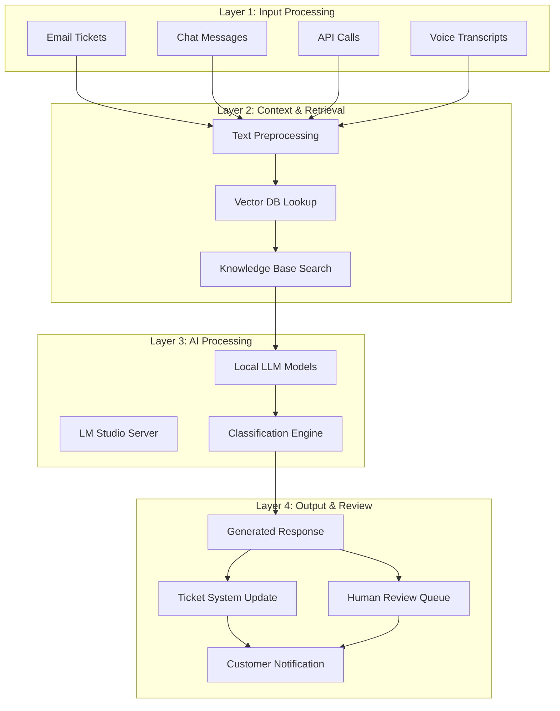
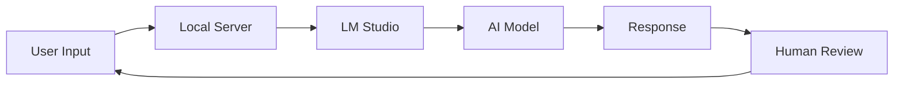
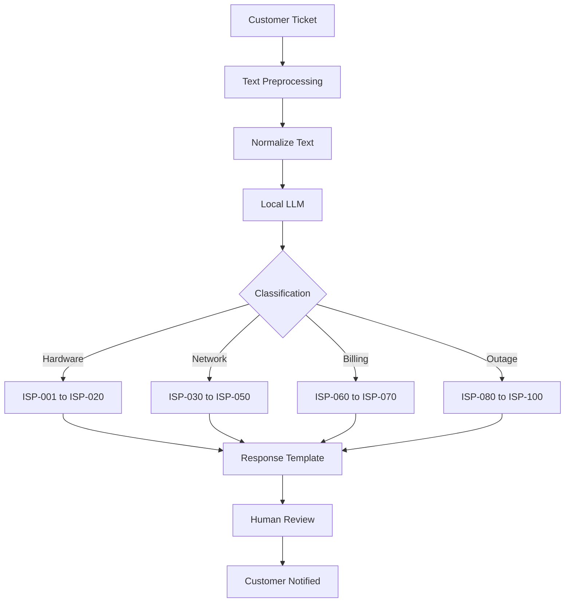
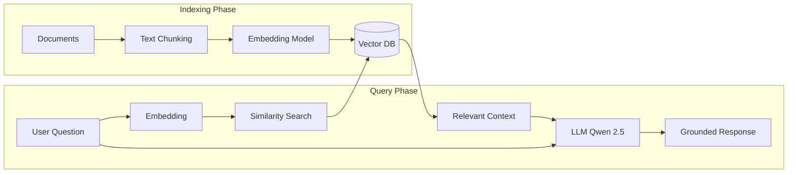
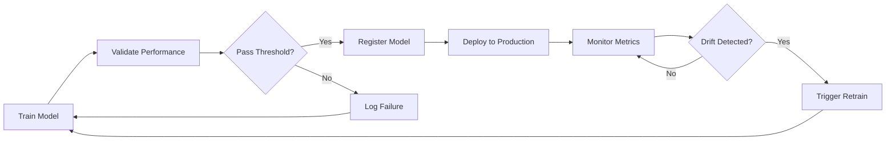

# Enterprise AI Automations

> Privacy-first AI agents for real-world ISP operations. No cloud. No data leaks. Pure local intelligence.

---

## Architecture Philosophy

This project is built on six core principles that guide every design decision.

**Privacy First** - All data stays on-premises. No cloud API calls for sensitive data. Complete data sovereignty ensures your customer information never leaves your infrastructure.

**Locality Only** - Run entirely on your own hardware. No internet dependency. Systems work offline when needed, giving you complete control over your AI operations.

**Speed Matters** - Small, efficient models (1.5B - 7B parameters) deliver fast inference times. Real-time responses for customer support without long wait times.

**Modular Design** - Each project is self-contained and easy to extend. Standalone functionality means you can pick and choose what you need without adopting everything at once.

**Production Ready** - Built with MLOps pipelines, monitoring, and A/B testing capabilities from the start. These aren't just demos - they're ready for real deployment.

**Human Centric** - AI assists but humans decide. All decisions are explainable with complete audit trails. Your team stays in control of every automated process.

---

## System Architecture

The overall system consists of four interconnected layers that work together to process, classify, and respond to customer requests. Each layer has a specific responsibility and can be scaled independently based on demand.



---

## Complete AI Pipeline

The following diagram shows how data flows through the entire system from input to final output.



### Models Used

| Model | Parameters | Purpose |
|-------|-----------|---------|
| Qwen 2.5 | 1.5B | Main classification and reasoning |
| Gemma 4 | E4B (4-bit) | Efficient inference, security analysis |

---

## Classification Workflow

This project focuses on classifying ISP customer complaints into categories. The classifier maps incoming tickets to specific ISP codes.



### Classification Categories

The system handles multiple categories of ISP issues:

- **Technical Issues**: Connection problems, speed issues, equipment failures
- **Billing**: Invoice disputes, payment processing, subscription changes
- **Service Outages**: Planned maintenance, unplanned downtime, region issues
- **Account Management**: Profile updates, password resets, service cancellations

---

## RAG Workflow

Retrieval-Augmented Generation combines your knowledge base with LLM capabilities for accurate, grounded responses.



### Knowledge Base Components

- **Vector Database**: ChromaDB for storing and retrieving embeddings
- **Embeddings**: sentence-transformers for semantic search
- **Context Window**: Combines retrieved knowledge with LLM reasoning

---

## MLOps Pipeline Workflow

Production-ready machine learning with continuous monitoring and automatic retraining.



### Pipeline Features

- **A/B Testing**: Compare model versions in production
- **Model Registry**: Version control for all trained models
- **Automatic Triggers**: Retrain when performance degrades
- **Monitoring**: Track accuracy, latency, and cost metrics

---

## Project Structure

This repository contains 11 project groups, each self-contained with its own documentation and examples.

### Project Groups

| Group | Description |
|-------|-------------|
| `getting-started/` | First steps with LM Studio and local LLM |
| `isp-classifier/` | Basic classification using rule-based and AI approaches |
| `isp-classifier-reasoning/` | Advanced reasoning with chain-of-thought |
| `qwen-rag/` | Retrieval-augmented generation with Qwen |
| `gemma-e4b/` | Google's efficient 4-bit quantized model |
| `hr-assistant/` | HR automation for leave management |
| `sla-system/` | Enterprise SLA management with AI approval |
| `enterprise-apps/` | Business applications integrating LLMs |
| `llm-demos/` | Various demonstration scripts |
| `mlops/` | MLOps pipeline with monitoring and A/B testing |
| `smart-gift/` | AI-powered admin automation |

---

## Quick Start

1. **Install LM Studio** from https://lmstudio.ai
2. **Download a model** (Qwen 2.5 1.5B or Gemma 4 E4B)
3. **Start the local server** in LM Studio (localhost:1234)
4. **Run any script** from the project groups

### Basic Example

```bash
cd getting-started
python talk_to_llm.py
```

### ISP Classification Example

```bash
cd isp-classifier
python app-classifier1.py
```

---

## Tech Stack

```
Language:        Python 3.10+
LLM Runtime:     LM Studio
Vector DB:       ChromaDB
Embeddings:      sentence-transformers
Framework:       LangChain, LlamaIndex
API Server:      FastAPI, Flask
Database:        PostgreSQL, MongoDB
Monitoring:      Grafana, Prometheus
Deployment:      Docker, Kubernetes
```

---

## License

MIT License - See LICENSE file for details.