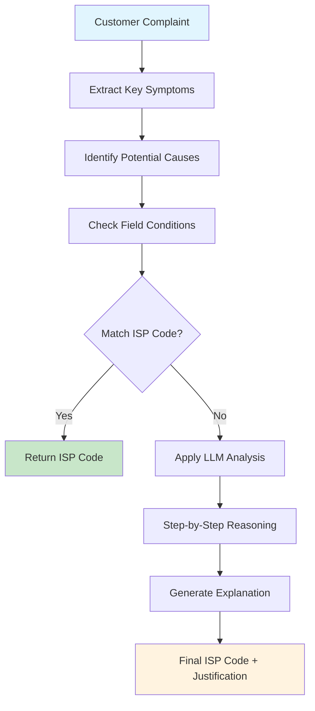
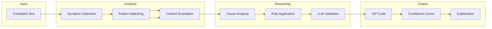
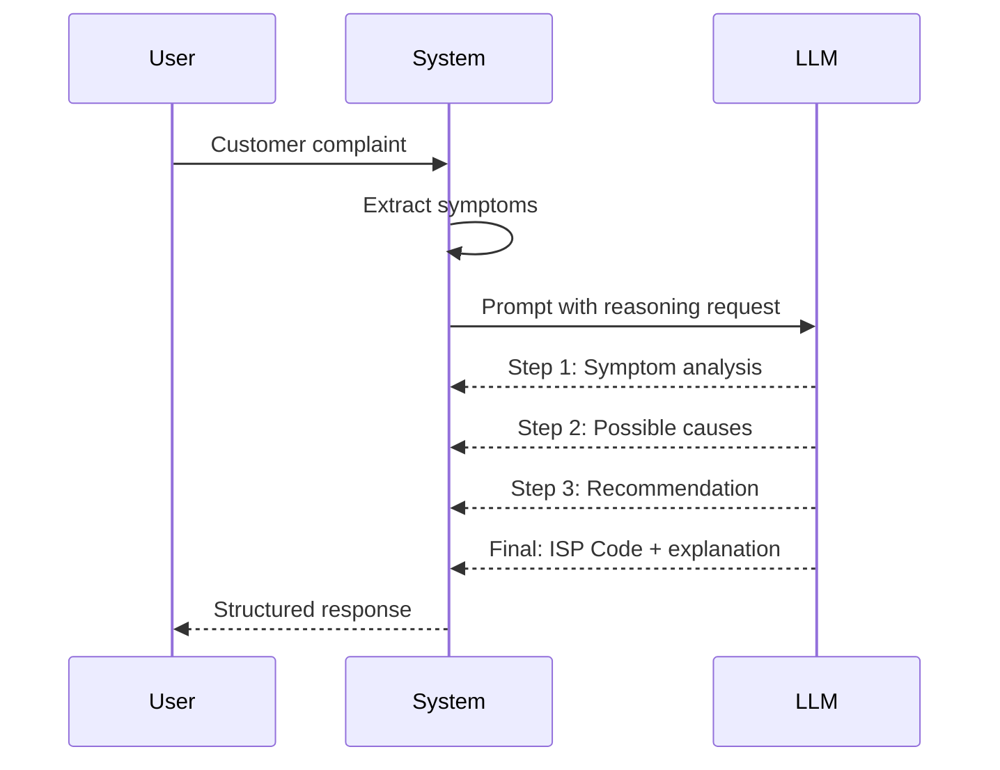
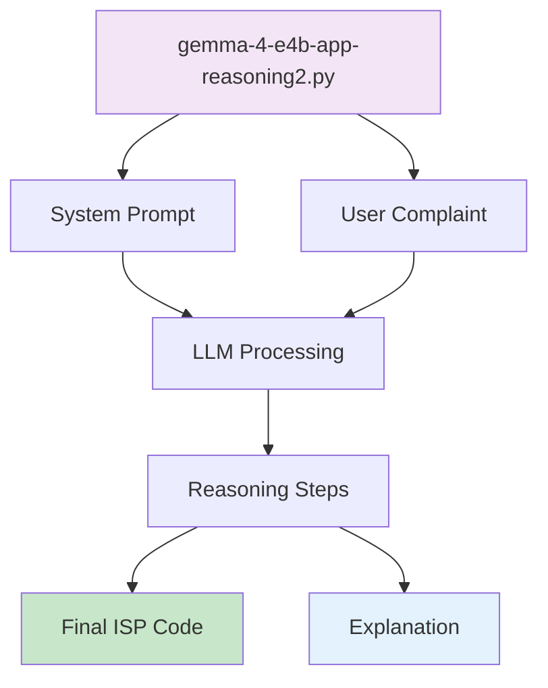

# Advanced Reasoning

Advanced reasoning demonstrates how a local LLM can perform multi-step, chain-of-thought (CoT) analysis to solve complex ISP tickets. The demos in this section use the **Gemma 4 E4B** model, which excels at breaking down problems into logical steps and providing transparent justifications.

## What is Chain-of-Thought?

Chain-of-Thought is a prompting technique where the model is asked to *explain its reasoning* before giving the final answer. This makes the output more trustworthy and allows developers to see how the model arrived at a decision.

## Reasoning Flow



## Multi-Stage Analysis



## Demo Overview

| Demo | Description | How to Run |
|------|-------------|------------|
| `gemma-4-e4b-app-reasoning2.py` | CoT demo that asks the model to list intermediate steps before giving the ISP code. | `python gemma-4-e4b-app-reasoning2.py` |

## How Chain-of-Thought Works



## Example Output

```
Input: "Customer reports red light on ONT, no internet for 2 hours"

Reasoning Steps:
1. Symptom Analysis: Red light + no internet indicates hardware/power issue
2. Possible Causes: ONT failure, fiber cut, power outage
3. Field Check: Red light specifically indicates fiber or hardware problem
4. Conclusion: Based on red light pattern, this is ISP-001

Final Code: ISP-001 (ONT / Red Light / Physical Fiber Issue)
Confidence: 94%
```

## Code Structure



## When to Use Advanced Reasoning

| Scenario | Use Basic | Use Advanced Reasoning |
|----------|-----------|------------------------|
| Clear, single-issue complaints | Yes | Yes |
| Multiple symptoms present | No | Yes |
| Ambiguous language | No | Yes |
| Requires justification | No | Yes |
| Regulatory audit trail needed | No | Yes |

## Running the Demo

```bash
# Ensure LM Studio is running with Gemma 4 E4B loaded
python gemma-4-e4b-app-reasoning2.py
```

The script will:
1. Load the customer complaint
2. Prompt the model with chain-of-thought instructions
3. Display intermediate reasoning steps
4. Return the final ISP code with explanation

## Customization

- **Adjust reasoning depth**: Modify the system prompt to request more or fewer steps
- **Add domain rules**: Update `FIELD_ISP_CODES` dictionary in baseline classifier
- **Tune confidence thresholds**: Adjust based on your accuracy requirements

*Chain-of-thought reasoning provides transparency and accuracy for complex ISP ticket classification.*