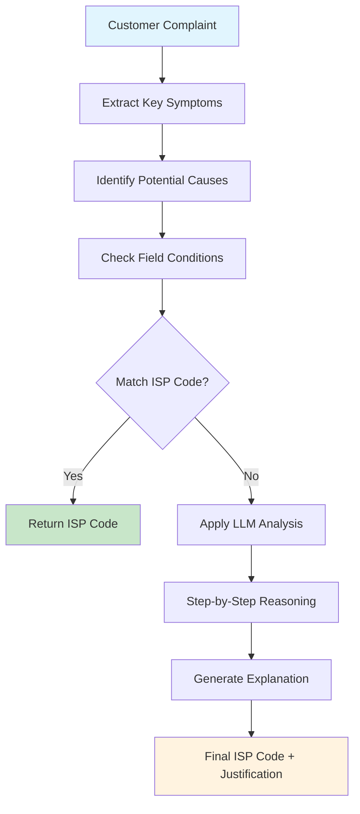
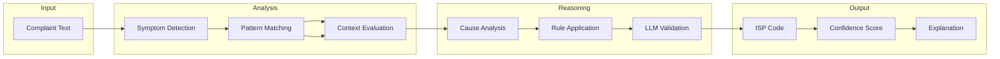
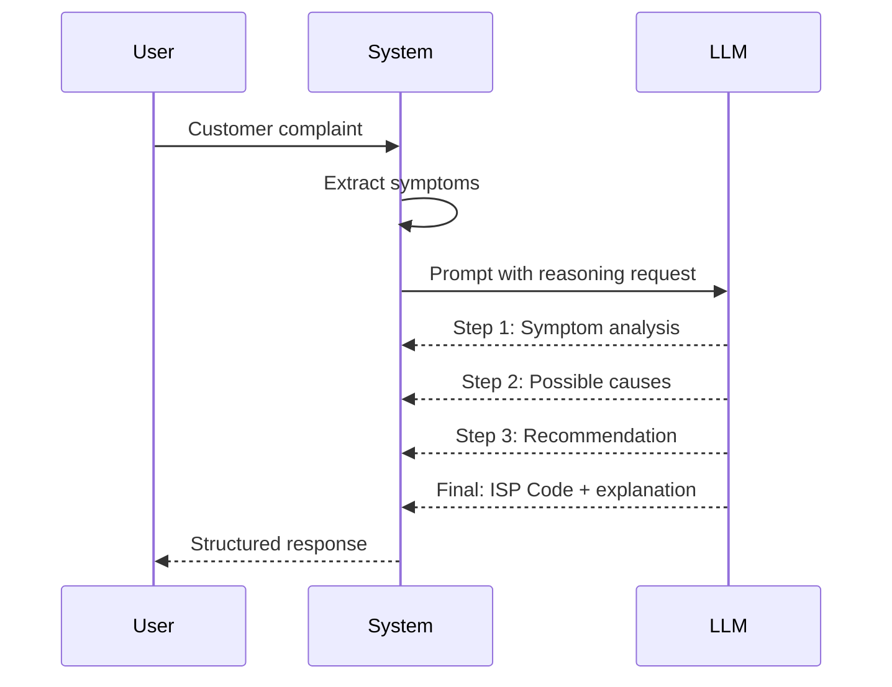
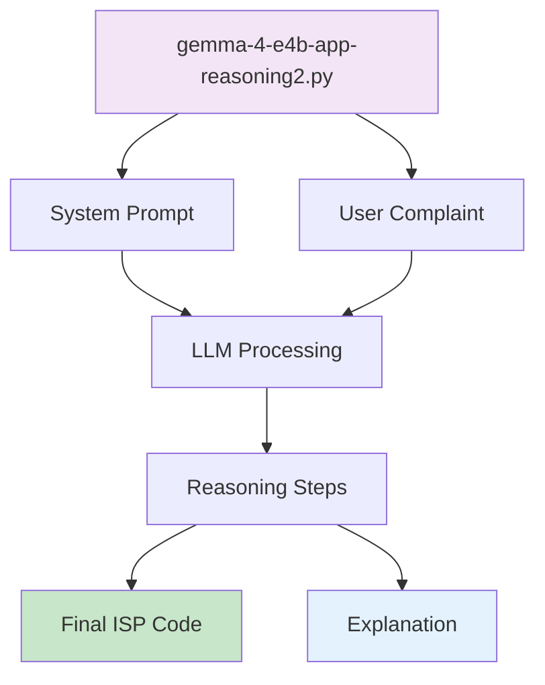

# Advanced Reasoning (Bangla)

Advanced reasoning দেখায় কিভাবে একটি local LLM multi-step, chain-of-thought (CoT) analysis ব্যবহার করে complex ISP tickets সমাধান করে। এই section-এর demos গুলো **Gemma 4 E4B** model ব্যবহার করে, যা problems-কে logical steps-এ ভাগ করতে এবং transparent justifications দিতে পারদর্শী।

## Chain-of-Thought কি?

Chain-of-Thought হলো একটি prompting technique যেখানে model-কে final answer দেওয়ার আগে *তার reasoning explain* করতে বলা হয়। এটা output-কে বেশি trustworthy করে এবং developers-দের দেখতে দেয় কিভাবে model একটা decision-এ এসেছে।

## Reasoning Flow



## Multi-Stage Analysis



## Demo Overview

| Demo | Description | How to Run |
|------|-------------|------------|
| `gemma-4-e4b-app-reasoning2.py` | CoT demo যা ISP code দেওয়ার আগে model-কে intermediate steps list করতে বলে। | `python gemma-4-e4b-app-reasoning2.py` |

## Chain-of-Thought কিভাবে কাজ করে



## Example Output

```
Input: "Customer reports red light on ONT, no internet for 2 hours"

Reasoning Steps:
1. Symptom Analysis: Red light + no internet indicates hardware/power issue
2. Possible Causes: ONT failure, fiber cut, power outage
3. Field Check: Red light specifically indicates fiber or hardware problem
4. Conclusion: Based on red light pattern, this is ISP-001

Final Code: ISP-001 (ONT / Red Light / Physical Fiber Issue)
Confidence: 94%
```

## Code Structure



## When to Use Advanced Reasoning

| Scenario | Use Basic | Use Advanced Reasoning |
|----------|-----------|------------------------|
| Clear, single-issue complaints | Yes | Yes |
| Multiple symptoms present | No | Yes |
| Ambiguous language | No | Yes |
| Requires justification | No | Yes |
| Regulatory audit trail needed | No | Yes |

## Running the Demo

```bash
# Ensure LM Studio is running with Gemma 4 E4B loaded
python gemma-4-e4b-app-reasoning2.py
```

Script টি:
1. Customer complaint load করবে
2. Chain-of-thought instructions দিয়ে model-কে prompt করবে
3. Intermediate reasoning steps display করবে
4. Explanation সহ final ISP code return করবে

## Customization

- **Reasoning depth adjust করুন**: System prompt modify করুন যাতে more বা fewer steps request করা যায়
- **Domain rules add করুন**: Baseline classifier-এর `FIELD_ISP_CODES` dictionary update করুন
- **Confidence thresholds tune করুন**: আপনার accuracy requirements অনুযায়ী adjust করুন

*Chain-of-thought reasoning complex ISP ticket classification-এর জন্য transparency এবং accuracy provide করে।*