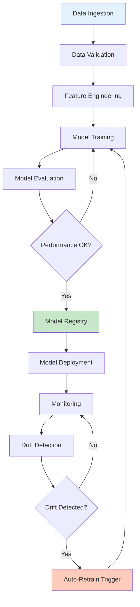
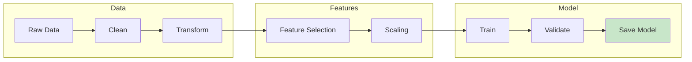
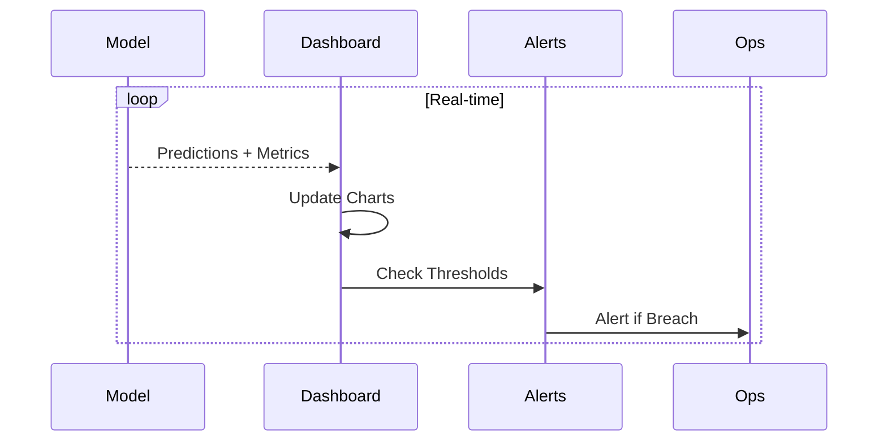
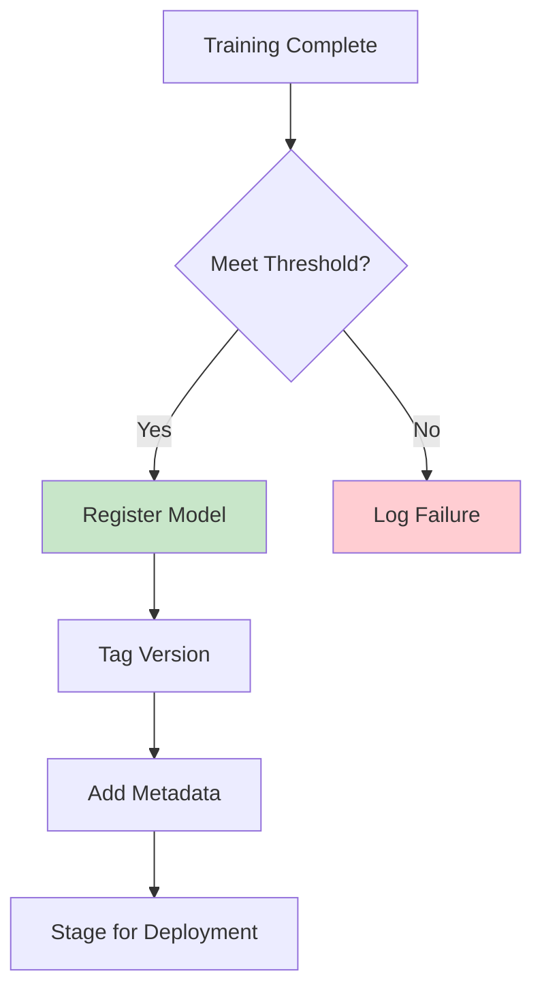
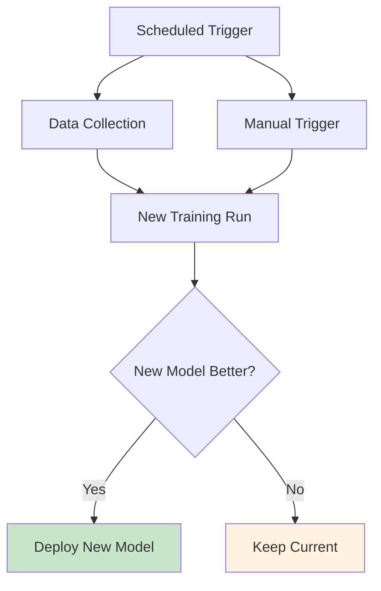
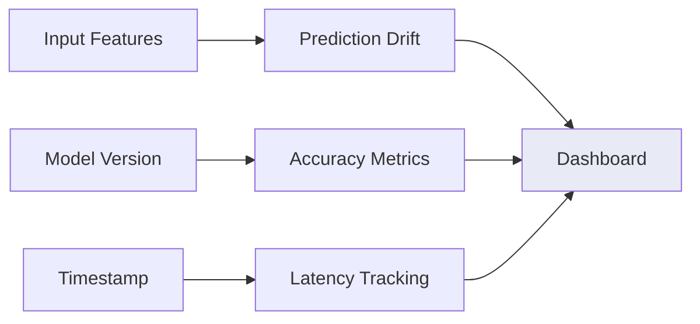
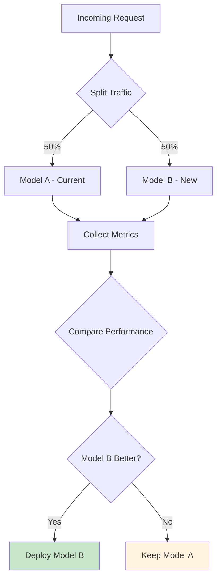

# MLOps গ্রাহক চুরি পূর্বাভাস (Bangla)

এই section টি customer churn prediction-এর জন্য end-to-end MLOps pipeline cover করে - data ingestion থেকে model deployment এবং monitoring পর্যন্ত। Implementation টি reasoning tasks-এর জন্য **Gemma 4 E4B** দিয়ে local LLM inference ব্যবহার করে।

## MLOps Pipeline Overview



## Training Pipeline



## Monitoring Dashboard



## Model Registry Flow



## Automated Retraining Pipeline



## Key MLOps Components

| Component | Purpose | Implementation |
|-----------|---------|----------------|
| Model Registry | Store and version models | Local file system with metadata |
| Monitoring | Track performance metrics | Real-time dashboard |
| Drift Detection | Detect data/concept drift | Statistical tests on features |
| Auto-Retrain | Trigger retraining when needed | Scheduled + threshold-based |

## Monitoring Metrics



## A/B Testing Framework



## Folder Structure

```
mlops/
├── model_registry.py         # Store and retrieve models
├── monitoring_dashboard.py   # Real-time metrics
├── drift_detection.py        # Detect model/data drift
├── auto_retrain.py           # Trigger retraining
├── ab_testing.py            # A/B testing framework
└── churn_pipeline.py        # End-to-end pipeline
```

## Running the Pipeline

```bash
# Start monitoring dashboard
python mlops/monitoring_dashboard.py

# Run complete pipeline
python mlops/churn_pipeline.py

# Check model registry
python mlops/model_registry.py --list
```

## Production Checklist

- [ ] Data validation passes
- [ ] Model meets accuracy threshold (>85%)
- [ ] Latency within SLA (<500ms)
- [ ] Monitoring dashboard active
- [ ] Alerts configured
- [ ] Rollback procedure documented

*এই MLOps pipeline production-এ customer churn prediction models-এর lifecycle manage করার জন্য complete framework provide করে।*

## Performance Baselines

| Metric | Target | Critical |
|--------|--------|----------|
| Accuracy | >85% | <80% |
| Precision | >80% | <75% |
| Recall | >82% | <78% |
| Latency | <500ms | >1000ms |
| Uptime | 99.9% | <99% |

Critical thresholds cross হলে team-কে notify করতে automated alerts set up করুন।
