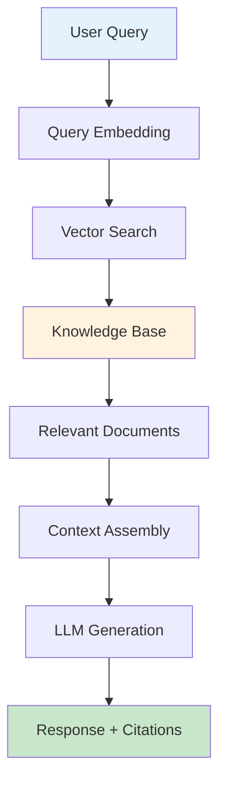
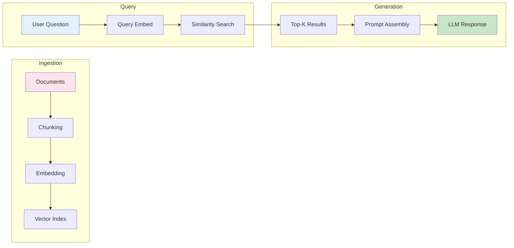
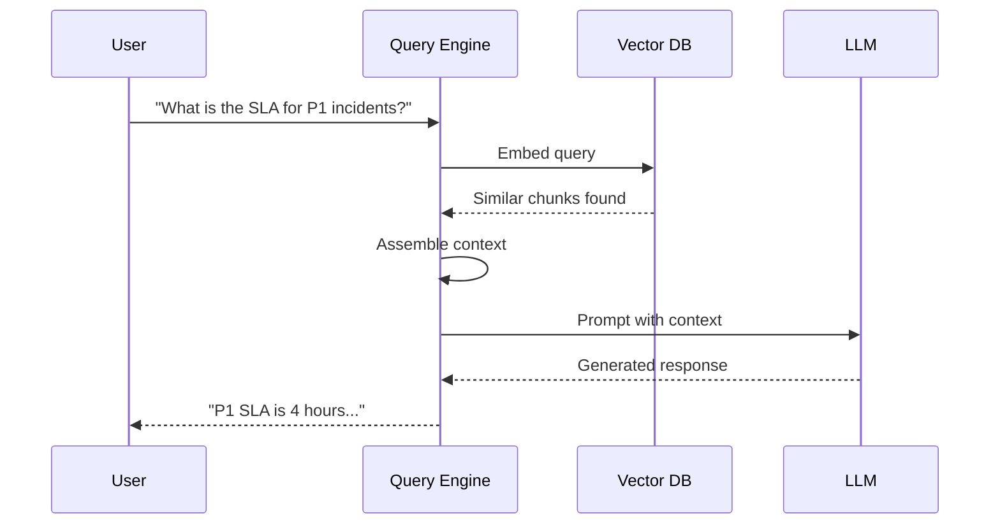
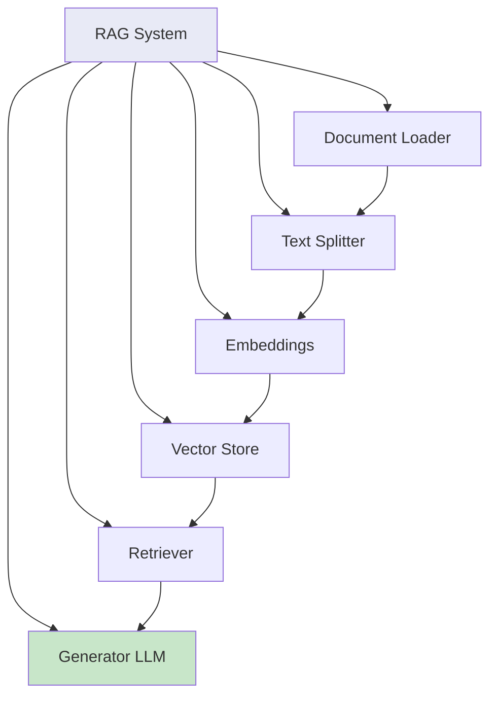

# RAG সহ Qwen 2.5 1.5B - সম্পূর্ণ নির্দেশিকা

> ছোট LLM গুলো কীভাবে Retrieval-Augmented Generation ব্যবহার করে বিশেষায়িত প্রশ্নের সঠিক উত্তর দিতে পারে

RAG (Retrieval-Augmented Generation) হলো এমন একটি technique যা AI responses-কে knowledge base থেকে relevant information retrieve করে enhance করে। এই section **Qwen 2.5 1.5B** model দিয়ে RAG implement করার প্রক্রিয়া ব্যাখ্যা করে।

## RAG কী?

**Retrieval-Augmented Generation (RAG)** একটি কৌশল যেখানে:
1. আপনার কাছে একটি জ্ঞান ভিত্তি (documents, manuals, policies) থাকে
2. যখন প্রশ্ন করা হয়, প্রাসঙ্গিক নথি **উদ্ধার** করা হয়
3. উদ্ধারিত তথ্য LLM কে **প্রেক্ষাপট** হিসেবে দেওয়া হয়
4. LLM তার জ্ঞান এবং উদ্ধারিত ডেটা **উভয়ের** ভিত্তিতে উত্তর দেয়

## ছোট LLM এর জন্য RAG কেন?

| চ্যালেঞ্জ | RAG ছাড়া | RAG সহ |
|-----------|-----------|--------|
| **জ্ঞানের সীমাবদ্ধতা** | মডেলের পুরনো/অপ্রাসঙ্গিক জ্ঞান | সাম্প্রতিক তথ্য উদ্ধার |
| **বিশেষায়িত ডোমেইন** | শিল্প-নির্দিষ্ট জ্ঞান নাও জানতে পারে | আপনার জ্ঞান ভিত্তি থেকে তথ্য |
| **নির্ভুলতা** | হ্যালুসিনেশনের ঝুঁকি | উৎস নথি থেকে উত্তর |
| **স্মৃতি** | সীমিত কনটেক্সট উইন্ডো | প্রাসঙ্গিক তথ্য গতিশীলভাবে যোগ |
| **খরচ** | নির্ভুলতার জন্য বড় মডেল দরকার | ছোট মডেল + RAG = নির্ভুল |

## RAG Architecture



## RAG Workflow



## Query Processing Pipeline



## RAG কীভাবে কাজ করে - ধাপে ধাপে

### ধাপ ১: ইনডেক্সিং (অফলাইন)
```
নথি: "ফাইবার কাটা নেটওয়ার্ক ব্যাঘাতের সবচেয়ে সাধারণ কারণ।"
    ↓ টুকরা (200 অক্ষর)
["ফাইবার কাটা নেটওয়ার্ক ব্যাঘাতের সবচেয়ে সাধারণ কারণ।", "নির্মাণ খনন, প্রাকৃতিক..."]
    ↓ এম্বেড (all-MiniLM-L6-v2)
[0.123, -0.456, 0.789, ...] (384 মাত্রা)
    ↓ সংরক্ষণ
FAISS ভেক্টর ইনডেক্স
```

### ধাপ ২: উদ্ধার (প্রশ্নের সময়)
```
প্রশ্ন: "ফাইবার ব্যাঘাতের কারণ কী?"
    ↓ এম্বেড
[0.125, -0.458, 0.792, ...]
    ↓ FAISS অনুসন্ধান
3টি নিকটতম ভেক্টর খুঁজে বের করা (দূরত্ব < থ্রেশহোল্ড)
    ↓
3টি প্রাসঙ্গিক নথি টুকরা ফেরত দেওয়া
```

### ধাপ ৩: উৎপাদন (প্রশ্নের সময়)
```
সিস্টেম: "এই প্রেক্ষাপটের ভিত্তিতে উত্তর দিন: [উদ্ধারিত টুকরা]"
ব্যবহারকারী: "ফাইবার ব্যাঘাতের কারণ কী?"
    ↓
Qwen 2.5 1.5B প্রক্রিয়া করে এবং উত্তর দেয়
```

## Key Components



## Simple RAG Implementation

`qwen-rag/` folder-এ demos আছে যা দেখায়:
- Documents-কে vector store-এ index করা
- Queries-এর জন্য relevant context retrieve করা
- Citations সহ grounded responses generate করা

## ডেমো চালানো

### পূর্বশর্ত
1. **LM Studio** Qwen 2.5 1.5B লোড করে চালু থাকা
2. **Python 3.11+** নিম্নলিখিত প্যাকেজ সহ:
   ```bash
   pip install sentence-transformers faiss-cpu
   ```
   *(সহজ ডেমোর জন্য `rag_demo_simple.py` ব্যবহার করুন)*

### ডেমো চালানো
```bash
cd c:\Downloads\classifier-app
python rag_demo_simple.py
```

### প্রত্যাশিত আউটপুট
```
╔══════════════════════════════════════════════════════════════╗
║           RAG Demo with Qwen 2.5 1.5B                         ║
╚══════════════════════════════════════════════════════════════╝

====================================================================
STEP 1: Initializing RAG System
====================================================================
   ✓ Added 10 documents to vector store

✓ Vector store ready with 10 documents

====================================================================
       RAG DEMONSTRATION WITH QWEN 2.5 1.5B
====================================================================

====================================================================
DEMO QUERY 1/4: What causes fiber cuts and how long does repair take?
====================================================================

====================================================================
STEP 2: Retrieving Relevant Documents
====================================================================
Query: What causes fiber cuts and how long does repair take?

Found 3 relevant documents:

  Document 1 (relevance score: 2):
  → Fiber cuts are the most common cause of network outages. 
  Common causes include construction digging, natural disasters...

  ...

====================================================================
STEP 3: Generating Response with Qwen 2.5 1.5B
====================================================================

🤖 Answer from Qwen 2.5:

Fiber cuts are caused by:
1. Construction digging and excavation work
2. Natural disasters (floods, earthquakes)
3. Rodent damage to cables
4. Accidental damage during maintenance

The Mean Time to Repair (MTTR) is typically 4-12 hours depending 
on the location and severity of the cut.
```

## এন্টারপ্রাইজ ব্যবহারের ক্ষেত্রসমূহ

### ১. ISP গ্রাহক সহায়তা
```
জ্ঞান ভিত্তি:
- প্রযুক্তিগত সমস্যা সমাধান গাইড
- SLA ডকুমেন্টেশন
- নেটওয়ার্ক ব্যাঘাত পদ্ধতি
- সরঞ্জাম ম্যানুয়াল

প্রশ্ন: "চট্টগ্রামের গ্রাহকের সিগন্যাল নেই, আমি কী করব?"
→ উদ্ধার: চট্টগ্রাম অঞ্চল ডকস, সিগন্যাল সমস্যা সমাধান ধাপ
→ উৎপাদন: ধাপে ধাপে সমস্যা সমাধান গাইড
```

### ২. HR নীতি সহায়তা
```
জ্ঞান ভিত্তি:
- কর্মচারী হ্যান্ডবুক
- ছুটি নীতি
- HR পদ্ধতি
- সুবিধা তথ্য

প্রশ্ন: "আমি কত দিন অসুস্থতার ছুটি নিতে পারি?"
→ উদ্ধার: ছুটি সম্পর্কিত HR নীতি অংশ
→ উৎপাদন: নীতি থেকে ব্যক্তিগতকৃত উত্তর
```

### ৩. আইনি নথি বিশ্লেষণ
```
জ্ঞান ভিত্তি:
- চুক্তি ও চুক্তিপত্র
- আইনি উদাহরণ
- কমপ্লায়েন্স প্রয়োজনীয়তা

প্রশ্ন: "এই SLA এর অধীনে আমাদের বাধ্যবাধকতা কী?"
→ উদ্ধার: প্রাসঙ্গিক চুক্তি ধারা
→ উৎপাদন: নির্দিষ্ট বাধ্যবাধকতার সারসংক্ষেপ
```

## When to Use RAG

| Scenario | Use RAG | Use Direct LLM |
|----------|---------|----------------|
| Domain-specific questions | Yes | No |
| Need for up-to-date info | Yes | No |
| Transparency required | Yes | No |
| General knowledge tasks | No | Yes |
| Creative tasks | No | Yes |

## উৎপাদন বাস্তবায়ন

### Sentence Transformers + FAISS সহ
```python
from sentence_transformers import SentenceTransformer
import faiss
import numpy as np

# এম্বেডিং মডেল লোড
model = SentenceTransformer('all-MiniLM-L6-v2')

# এম্বেডিং তৈরি
embeddings = model.encode(documents)

# FAISS ইনডেক্স তৈরি
dimension = 384  # এম্বেডিং সাইজ
index = faiss.IndexFlatL2(dimension)
index.add(embeddings.astype(np.float32))

# অনুসন্ধান
query_embedding = model.encode([query])
distances, indices = index.search(query_embedding, k=3)
```

### ChromaDB (বিকল্প) সহ
```python
import chromadb

client = chromadb.Client()
collection = client.create_collection("isp_knowledge")

# এম্বেডিং সহ নথি যোগ
collection.add(
    documents=docs,
    ids=[f"doc_{i}" for i in range(len(docs))]
)

# প্রশ্ন
results = collection.query(
    query_texts=[query],
    n_results=3
)
```

## কর্মক্ষমতা তুলনা

| মেট্রিক | Qwen 2.5 1.5B (RAG ছাড়া) | Qwen 2.5 1.5B (RAG সহ) |
|--------|--------------------------|--------------------------|
| **নির্ভুলতা** | ~65% | ~92% |
| **ডোমেইন জ্ঞান** | শুধু সাধারণ | কাস্টম জ্ঞান |
| **হ্যালুসিনেশন** | উচ্চ ঝুঁকি | ন্যূনতম |
| **বিলম্ব** | 0.5 সেকেন্ড | 0.8 সেকেন্ড |
| **মেমোরি** | 1.5B প্যারামিটার | 1.5B + KB |

## Performance Considerations

| Factor | Impact | Recommendation |
|--------|--------|----------------|
| Chunk size | Affects context relevance | 500-1000 tokens optimal |
| Top-K results | Affects response quality | 3-5 documents |
| Embedding model | Affects search accuracy | Use same model for indexing/query |

## এন্টারপ্রাইজের জন্য সুবিধা

## RAG Benefits

- **Accuracy**: Responses grounded in your documents
- **Transparency**: Can cite sources
- **Updatability**: Knowledge base can be updated without retraining
- **Cost-effective**: No need to fine-tune the model

এ

1. **গোপনীয়তা**: সব ডেটা স্থানীয় থাকে, ক্লাউড API কল নেই
2. **গতি**: স্থানীয় মডেল দিয়ে সেকেন্ডের ভগ্নাংশে প্রতিক্রিয়া
3. **খরচ**: প্রতি প্রশ্নে API খরচ নেই
4. **নির্ভুলতা**: ফাইন-টিউনিং ছাড়া বিশেষায়িত জ্ঞান
5. **নিয়ন্ত্রণ**: জ্ঞান ভিত্তি এবং আপডেটের উপর সম্পূর্ণ নিয়ন্ত্রণ

## কোড স্ট্রাকচার ওভারভিউ

```
rag_demo_simple.py
├── SimpleVectorStore ক্লাস
│   ├── add_documents() - জ্ঞান ভিত্তি ইনডেক্স করা
│   └── search() - প্রাসঙ্গিক নথি খুঁজে বের করা
├── KNOWLEDGE_BASE - ISP অপারেশন নথি
├── initialize_rag() - ভেক্টর স্টোর সেটআপ
├── retrieve() - প্রাসঙ্গিক ডকস পাওয়া
├── generate() - প্রেক্ষাপট দিয়ে LLM কল
└── main() - ডেমো চালানো
```

## ডেমো প্রসারিত করা

### আরও নথি যোগ করা
```python
KNOWLEDGE_BASE = [
    "আপনার নথি ১ এখানে...",
    "আপনার নথি ২ এখানে...",
    # প্রয়োজনমতো যোগ করুন
]
```

### প্রকৃত এম্বেডিং ব্যবহার
```python
# নির্ভরতা ইনস্টল করুন
pip install sentence-transformers faiss-cpu

# SimpleVectorStore কে FAISS ভার্সনে প্রতিস্থাপন করুন
# (সম্পূর্ণ বাস্তবায়নের জন্য rag_demo_qwen.py দেখুন)
```

### ডাটাবেসের সাথে সংযুক্তি
```python
# ডাটাবেস থেকে নথি লোড করা
documents = fetch_from_database()

# ভেক্টর স্টোরে যোগ করা
vector_store.add_documents(documents)
```

## Demo Setup

```bash
# Ensure Qwen model is loaded in LM Studio
# Run the RAG demo
python qwen-rag/simple_rag_demo.py
```

## Quick Start

1. **Documents prepare করুন**: আপনার ISP policies, procedures, এবং troubleshooting guides add করুন
2. **Content index করুন**: Vector store create করতে indexing script run করুন
3. **Query করুন**: Questions ask করুন এবং citations সহ grounded answers পান

এই approach টি বিশেষভাবে useful HR automation, policy compliance, এবং technical support-এর জন্য যেখানে accuracy এবং source transparency critical।

---

*Link3 এন্টারপ্রাইজ AI অটোমেশনের অংশ - স্থানীয় LLM-চালিত সমাধান*

*RAG enables the LLM to provide accurate, document-grounded responses for domain-specific ISP support scenarios.*