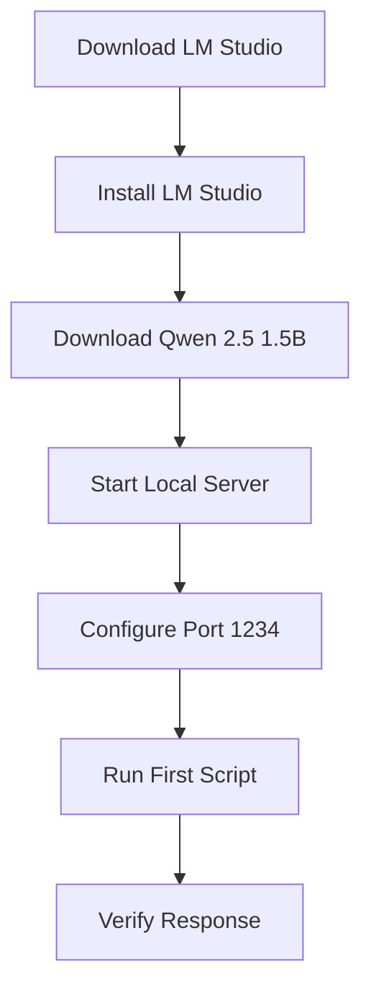
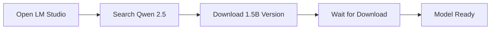
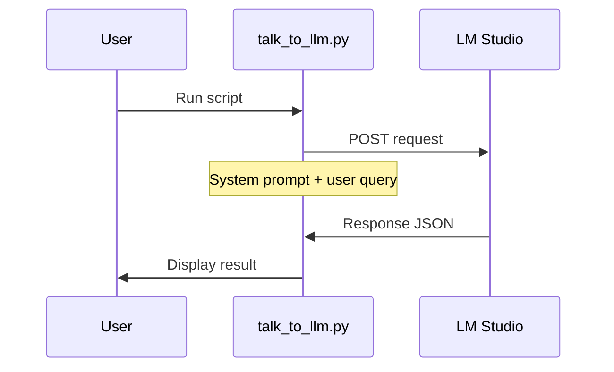

# Getting Started

This guide walks you through setting up your first local LLM application. By the end, you will have a working AI system that runs entirely on your machine.

## Prerequisites

- Python 3.10 or higher
- LM Studio installed
- A model downloaded (Qwen 2.5 1.5B recommended for beginners)

## Setup Flow



## Step 1: Install LM Studio

Download and install LM Studio from [https://lmstudio.ai](https://lmstudio.ai)

## Step 2: Download a Model



1. Open LM Studio
2. Click on the search bar
3. Search for "Qwen2.5 1.5B"
4. Download the Q4_K_M version (smaller, faster)
5. Wait for download to complete

## Step 3: Start the Server

1. Click "Local Server" tab in LM Studio
2. Select "Qwen 2.5 1.5B" model
3. Click "Start Server"
4. Server runs at `http://localhost:1234`

## Step 4: Run Your First Script

```bash
cd getting-started
python talk_to_llm.py
```

### What the Script Does



## Step 5: Verify Everything Works

Expected output:
```
Response: This is a response from the local LLM...
Model: qwen2.5-1.5b-instruct
```

## Troubleshooting

| Issue | Solution |
|-------|----------|
| Connection refused | Ensure LM Studio server is running |
| Model not found | Download model in LM Studio |
| Slow response | Try a smaller model or reduce max_tokens |
| Empty response | Check system prompt formatting |

## Next Steps

- [Getting Started with Qwen 2.5](getting-started-qwen.md) - More advanced usage
- [ISP Classification](isp-classification-qwen.md) - Your first real application
- [RAG with Qwen](rag-qwen.md) - Add knowledge base capabilities