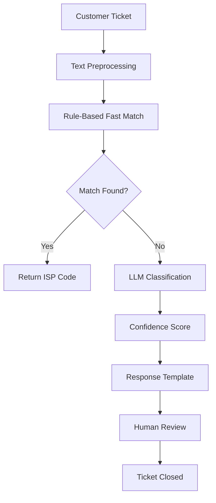
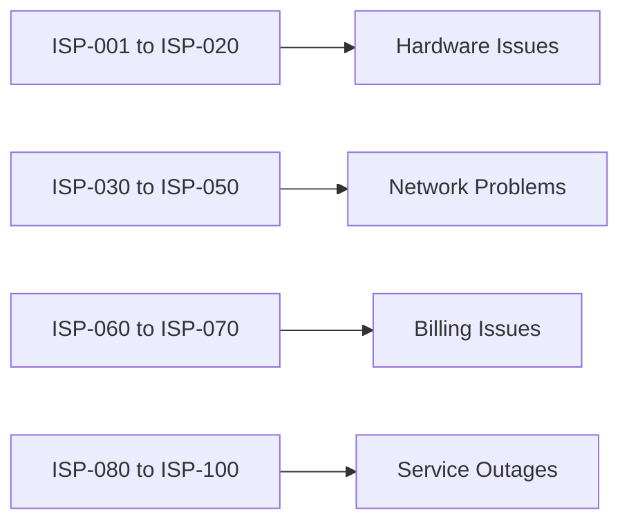
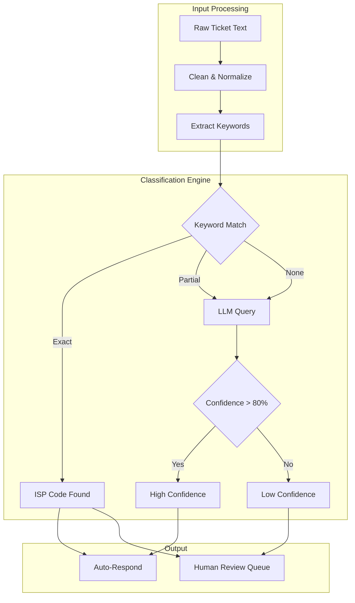
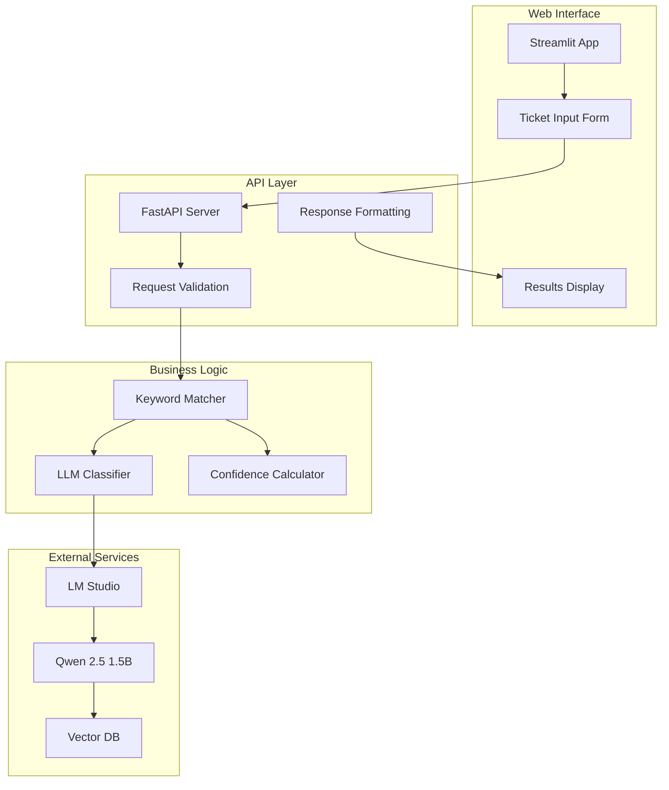
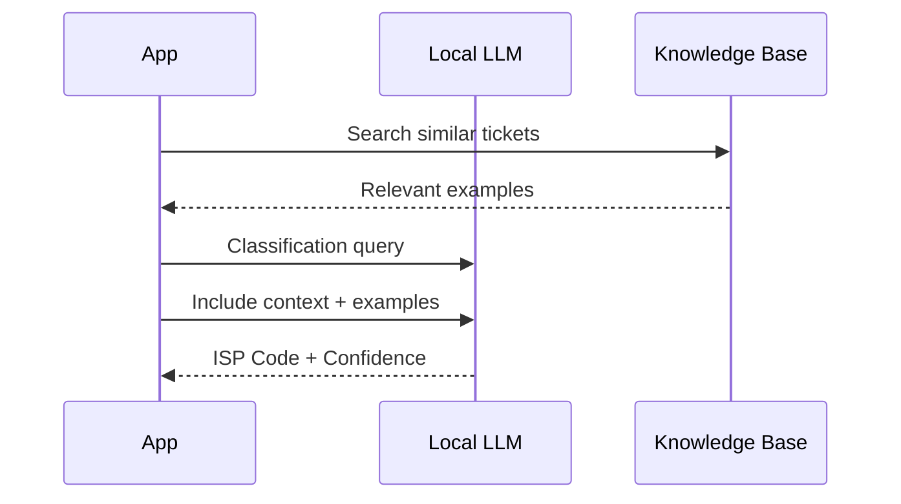

# ISP Classification

This section documents the ticket classification system that maps customer complaints to specific ISP codes. The system uses local LLMs to understand and categorize incoming tickets.

## Overview

The classification system processes ISP tickets through a multi-stage pipeline:



## Classification Categories



### Hardware Issues (ISP-001 to ISP-020)

| Code | Description |
|------|-------------|
| ISP-001 | Red light / Physical fiber cut |
| ISP-002 | ONT malfunction |
| ISP-003 | Router replacement needed |

### Network Problems (ISP-030 to ISP-050)

| Code | Description |
|------|-------------|
| ISP-030 | Slow connection |
| ISP-031 | Packet loss |
| ISP-032 | DNS resolution failure |

### Billing Issues (ISP-060 to ISP-070)

| Code | Description |
|------|-------------|
| ISP-060 | Invoice dispute |
| ISP-061 | Payment failed |
| ISP-062 | Subscription change |

### Service Outages (ISP-080 to ISP-100)

| Code | Description |
|------|-------------|
| ISP-080 | Planned maintenance |
| ISP-081 | Region-wide outage |
| ISP-082 | Weather-related downtime |

## Classification Workflow



## Architecture Diagram



## Running the Classifier

### Basic Usage

```bash
cd isp-classifier
python app-classifier1.py
```

### With Reasoning

```bash
python app-reasoning1.py
```

### Streamlit Interface

```bash
streamlit run app-baseline-class.py
```

## Sample Output

```json
{
  "ticket": "My ONT is showing red light",
  "predicted_code": "ISP-002",
  "confidence": 92,
  "justification": "Red light on ONT indicates hardware malfunction",
  "field_dispatch": true
}
```

## Implementation Details

### Rule-Based Matching

```python
FIELD_ISP_CODES = {
    "red light": "ISP-001",
    "fiber cut": "ISP-001",
    "ont": "ISP-002",
    "router": "ISP-003",
}
```

### LLM Fallback

When rules don't match, the system queries the local LLM:



## Next Steps

- [Advanced Reasoning](advanced-reasoning.md) - Chain-of-thought classification
- [RAG System](rag-qwen.md) - Enhance with knowledge retrieval
- [Gemma Version](isp-classification-gemma.md) - Using Gemma 4 E4B model