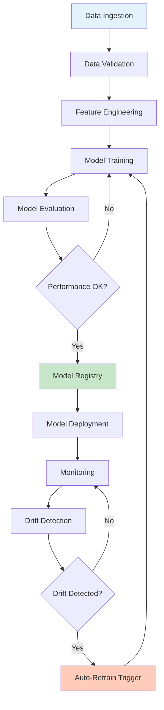
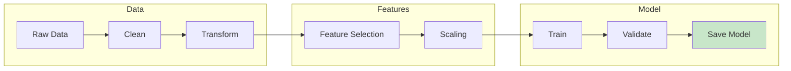
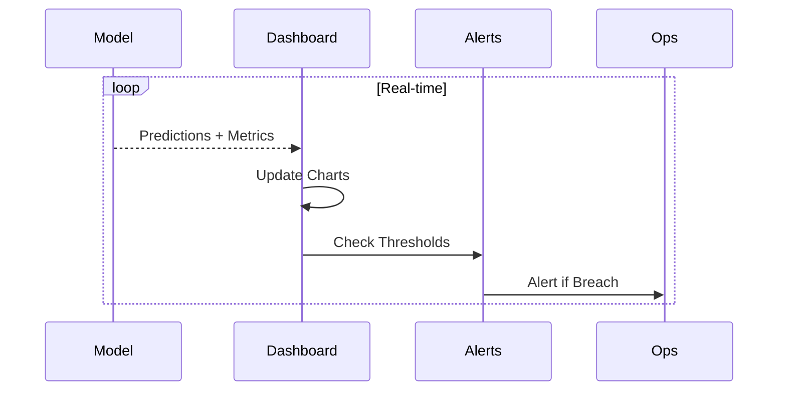
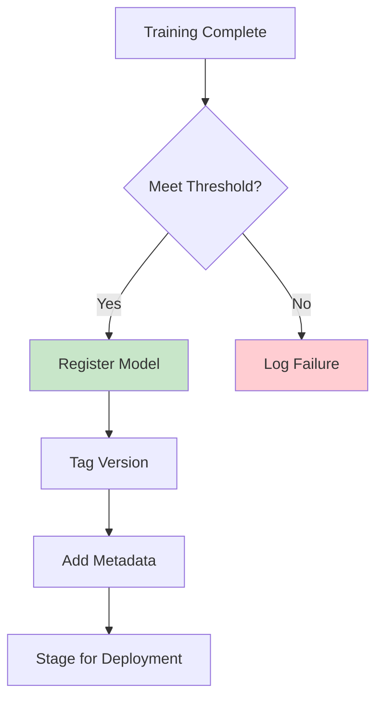
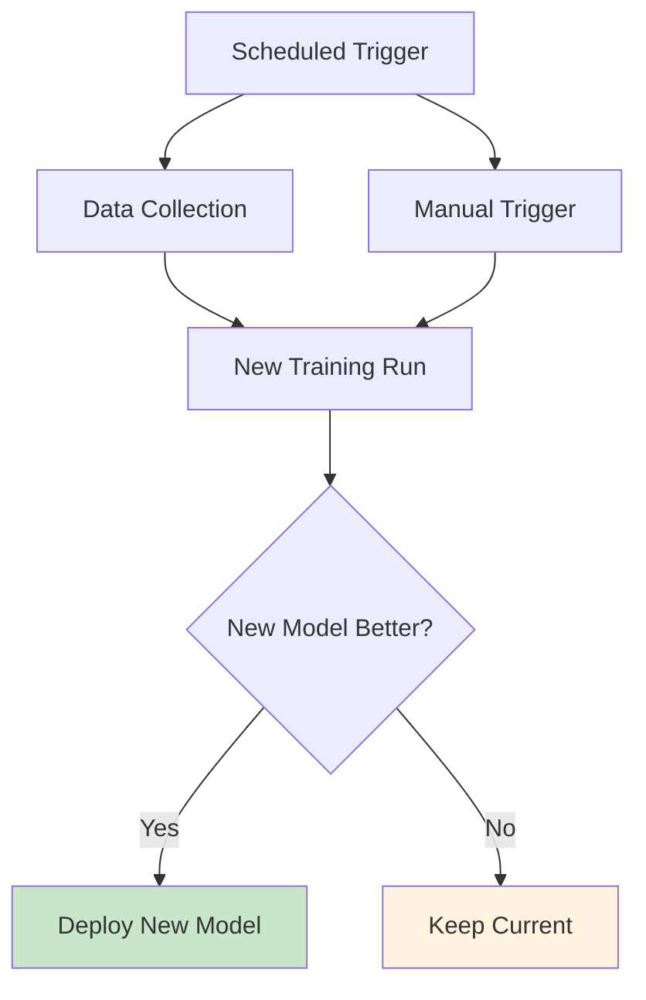
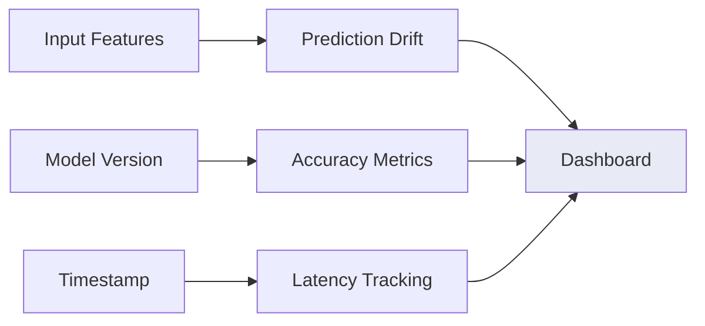
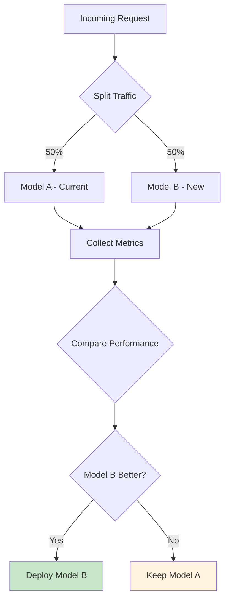

# MLOps Customer Churn Prediction

> Building production-ready ML pipelines for ISP customer retention

**Author:** Rakibul Hassan  
**Company:** Link3 Technologies  
**Date:** January 2025

---

## Overview

This module demonstrates **Machine Learning Operations (MLOps)** practices specifically designed for customer churn prediction in an ISP environment. Built with local LLMs (Qwen 2.5 1.5B and Gemma 4 E4B), it provides a complete production-ready pipeline that can be deployed entirely on-premise.

## MLOps Pipeline Overview



## Why MLOps for Churn Prediction?

### The Challenge

- Customer churn costs ISPs significant revenue
- Traditional rule-based systems miss subtle patterns
- Need to continuously improve prediction accuracy
- Regulatory requirements for model transparency

### The MLOps Solution

```
┌─────────────────────────────────────────────────────────────┐
│                   MLOps Pipeline Flow                      │
├─────────────────────────────────────────────────────────────┤
│                                                             │
│   Data → Features → Train → Evaluate → Register → Deploy   │
│                                         ↓                   │
│                              Monitor → Detect Drift         │
│                                         ↓                   │
│                                   Retrain Loop              │
│                                                             │
└─────────────────────────────────────────────────────────────┘
```

## Components

### 1. Churn Pipeline (`churn_pipeline.py`)

End-to-end machine learning pipeline with stages:

| Stage | Description |
|-------|-------------|
| **Data Ingestion** | Collect and validate customer data |
| **Feature Engineering** | Extract predictive features from complaints, tickets, billing |
| **LLM Prediction** | Use local LLM for churn risk assessment |
| **Model Evaluation** | Calculate accuracy, precision, recall |

### 2. Model Registry (`model_registry.py`)

Track and manage model versions:

- Version control for all model iterations
- Performance metrics storage
- Deployment history tracking
- Rollback capabilities

### 3. Performance Monitor (`monitor.py`)

Real-time observability:

- Latency tracking (p50, p95, p99)
- Error rate monitoring
- Health checks with automatic alerts
- Prediction logging

### 4. A/B Tester (`ab_tester.py`)

Data-driven model comparison:

- Traffic splitting between model variants
- Statistical significance testing
- Winner determination and promotion
- Experiment tracking

### 5. Retrain Trigger (`retrain_trigger.py`)

Automated maintenance:

- Performance drift detection
- Latency degradation monitoring
- Error rate spike alerts
- Scheduled retraining

## Training Pipeline



## Monitoring Dashboard



## Model Registry Flow



## Automated Retraining Pipeline



## Key MLOps Components

| Component | Purpose | Implementation |
|-----------|---------|----------------|
| Model Registry | Store and version models | Local file system with metadata |
| Monitoring | Track performance metrics | Real-time dashboard |
| Drift Detection | Detect data/concept drift | Statistical tests on features |
| Auto-Retrain | Trigger retraining when needed | Scheduled + threshold-based |

## Monitoring Metrics



## A/B Testing Framework



## Quick Start

```python
from mlops import ChurnPipeline, ModelRegistry, PerformanceMonitor

# Initialize pipeline
pipeline = ChurnPipeline()

# Run prediction
customer = {
    'customer_id': 'CUST-001',
    'complaints': [...],
    'billing_history': {...},
    'support_tickets': [...]
}

result = pipeline.run_pipeline(customer)
print(f"Risk Level: {result['prediction']['risk_level']}")
```

## Folder Structure

```
mlops/
├── model_registry.py         # Store and retrieve models
├── monitoring_dashboard.py   # Real-time metrics
├── drift_detection.py        # Detect model/data drift
├── auto_retrain.py           # Trigger retraining
├── ab_testing.py            # A/B testing framework
└── churn_pipeline.py        # End-to-end pipeline
```

## Architecture Diagram

```
┌──────────────────────────────────────────────────────────────────┐
│                     MLOps Churn Prediction System                │
├──────────────────────────────────────────────────────────────────┤
│                                                                   │
│  ┌─────────────┐    ┌─────────────┐    ┌─────────────────────┐  │
│  │ Customer    │───▶│ Feature     │───▶│ LLM Prediction      │  │
│  │ Data        │    │ Engineering │    │ (Qwen/Gemma)        │  │
│  └─────────────┘    └─────────────┘    └─────────────────────┘  │
│                                                │                  │
│                                                ▼                  │
│  ┌─────────────┐    ┌─────────────┐    ┌─────────────────────┐  │
│  │ Retrain     │◀───│ Monitor     │◀───│ Risk Assessment     │  │
│  │ Trigger     │    │             │    │ & Recommendation    │  │
│  └─────────────┘    └─────────────┘    └─────────────────────┘  │
│         ▲                                                          │
│         │                                                          │
│  ┌──────┴──────┐    ┌─────────────┐    ┌─────────────────────┐  │
│  │ Model       │◀───│ A/B Test    │───▶│ Production          │  │
│  │ Registry    │    │ Framework   │    │ Deployment          │  │
│  └─────────────┘    └─────────────┘    └─────────────────────┘  │
│                                                                   │
└──────────────────────────────────────────────────────────────────┘
```

## Key Features

### Feature Engineering

The pipeline extracts these predictive features:

- **Complaint Metrics**: Total complaints, recent complaints (30d/90d), complaint categories
- **Support Ticket Metrics**: Open tickets, average resolution time, ticket frequency
- **Billing Metrics**: Payment delays, plan changes, subscription duration
- **Engagement Score**: Composite score derived from all factors

### Risk Scoring

```
Risk Score = f(complaints, tickets, billing, engagement)

Where:
- High complaint volume (+0.3)
- Open support tickets (+0.2)
- Payment delays (+0.15)
- Slow resolution time (+0.1)
- Low engagement score (+0.2)
```

### LLM Integration

Uses local LLMs for nuanced prediction:

```python
# Prompt engineering for churn assessment
prompt = """Analyze this ISP customer for churn risk:

Features:
- Total Complaints: {features['total_complaints']}
- Recent Complaints: {features['recent_complaints_30d']}
- Open Tickets: {features['open_tickets']}
- Payment Delays: {features['payment_delays']}
- Engagement Score: {features['engagement_score']:.2f}

Respond with risk assessment and retention recommendations."""
```

## Running the Pipeline

```bash
# Start monitoring dashboard
python mlops/monitoring_dashboard.py

# Run complete pipeline
python mlops/churn_pipeline.py

# Check model registry
python mlops/model_registry.py --list
```

## Performance Considerations

### For Local LLM Deployment

- **Model Selection**: Qwen 2.5 1.5B for speed, Gemma 4 E4B for accuracy
- **Batch Processing**: Process customers in batches for efficiency
- **Caching**: Cache frequent predictions to reduce API calls
- **Fallback**: Rule-based prediction when LLM unavailable

### Monitoring Thresholds

| Metric | Warning | Critical |
|--------|---------|----------|
| Latency | > 2000ms | > 5000ms |
| Error Rate | > 5% | > 10% |
| Accuracy Drift | > 5% | > 10% |

## Production Checklist

- [ ] Data validation passes
- [ ] Model meets accuracy threshold (>85%)
- [ ] Latency within SLA (<500ms)
- [ ] Monitoring dashboard active
- [ ] Alerts configured
- [ ] Rollback procedure documented

## Performance Baselines

| Metric | Target | Critical |
|--------|--------|----------|
| Accuracy | >85% | <80% |
| Precision | >80% | <75% |
| Recall | >82% | <78% |
| Latency | <500ms | >1000ms |
| Uptime | 99.9% | <99% |

Set up automated alerts to notify your team when any metric crosses critical thresholds.

## Next Steps

1. **Integrate with CRM**: Connect to real customer databases
2. **Set up Webhooks**: Configure notification systems
3. **Implement CI/CD**: Automate model deployment pipeline
4. **Add Dashboard**: Build Streamlit monitoring dashboard

## Related Documentation

- [ISP Classification with Qwen](../isp-classification-qwen.md)
- [ISP Classification with Gemma](../isp-classification-gemma.md)
- [Getting Started with Qwen](../getting-started-qwen.md)
- [Stress Testing Qwen](../stress-testing-qwen.md)

*This MLOps pipeline provides a complete framework for managing the lifecycle of customer churn prediction models in production.*
