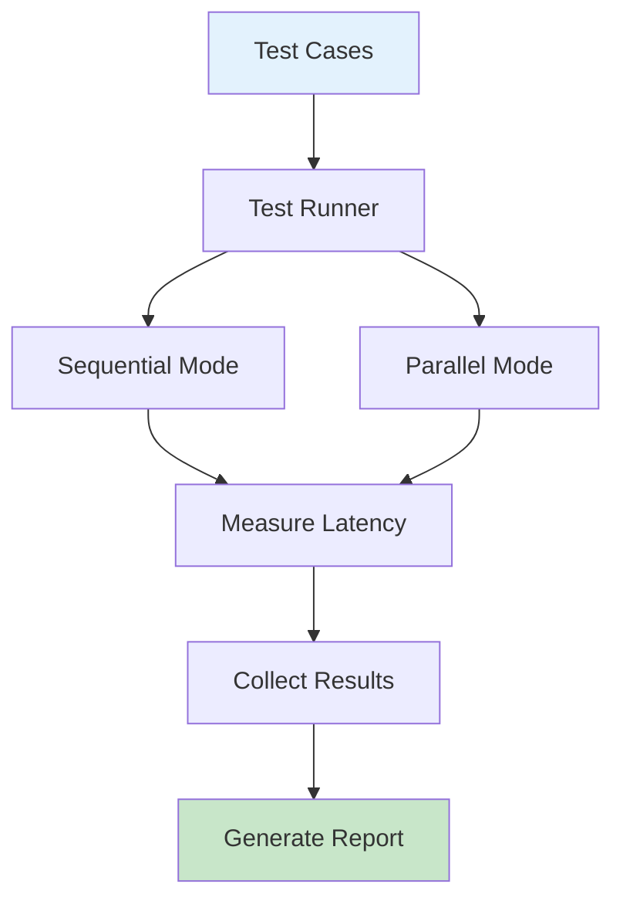
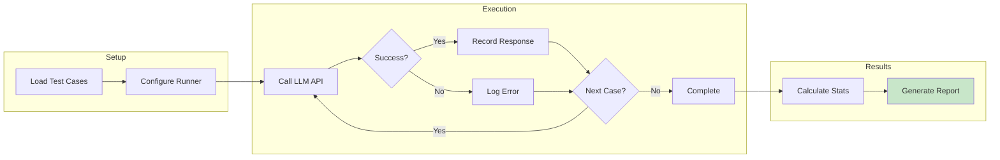
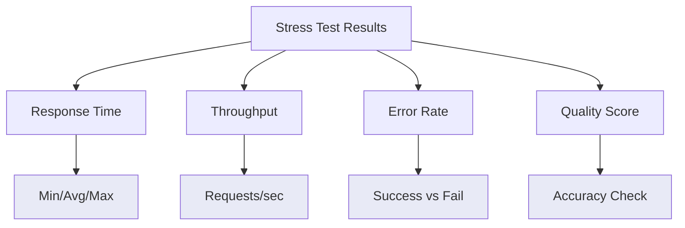
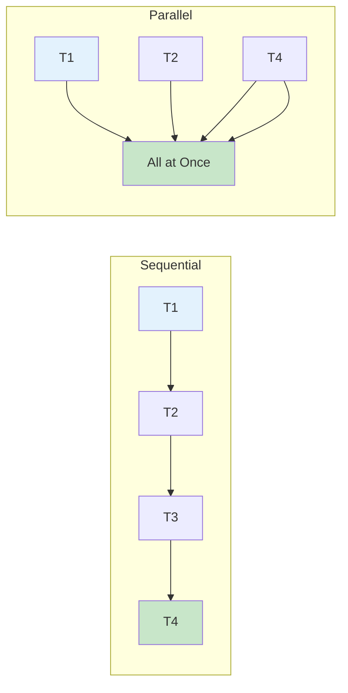
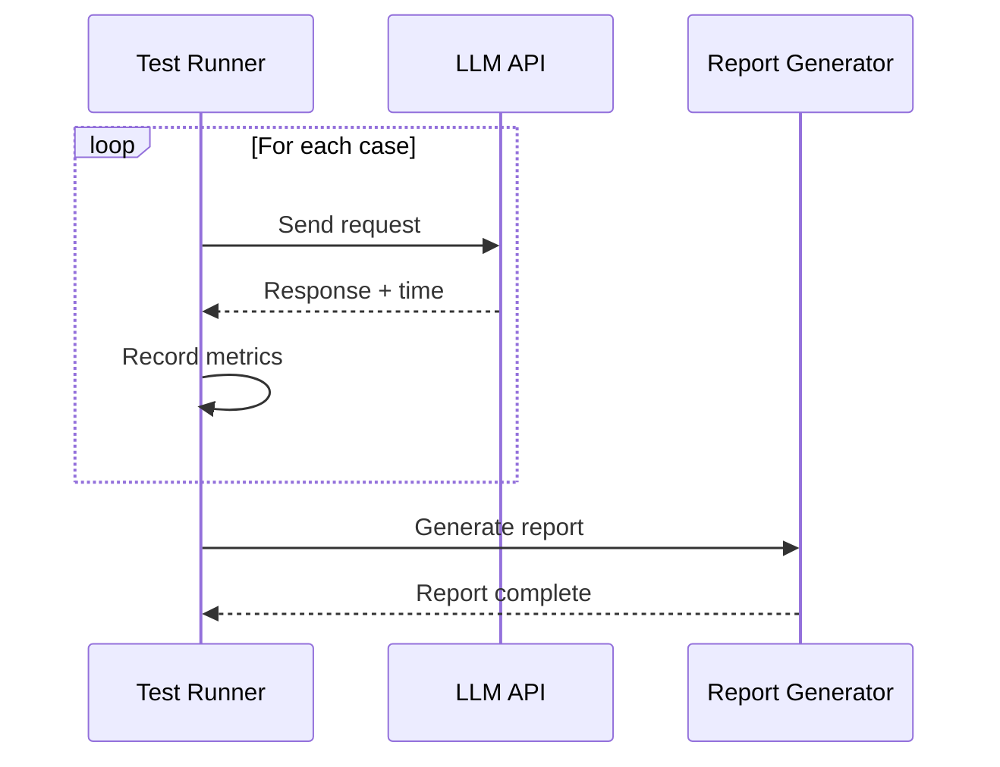
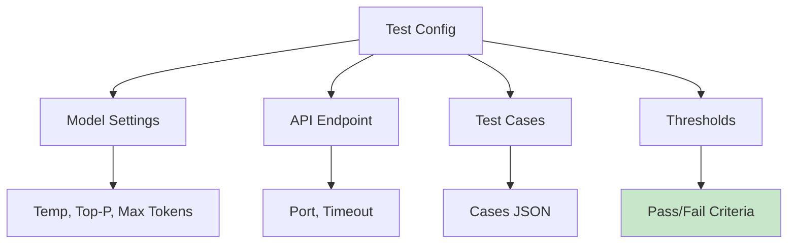

# Stress Testing

Stress testing evaluates how the LLM performs under load, measuring response times, throughput, and quality across different scenarios. This section demonstrates stress testing with the **Gemma 4 E4B** model.

## Test Workflow



## Test Execution Flow



## Performance Metrics



## Test Case Structure

| Test Type | Cases | Purpose |
|-----------|-------|---------|
| Mini Demo | 5 | Quick validation |
| Small Demo | 10 | Basic functionality |
| Standard Test | 55 | Comprehensive evaluation |
| Stress Test | 100+ | Performance limits |

## Sequential vs Parallel



## Test Reports



## Demo Scripts

| Script | Cases | Description |
|--------|-------|-------------|
| `llm_mini_demo_5cases.py` | 5 | Quick sanity check |
| `llm_demo_small_10case.py` | 10 | Standard validation |
| `llm_hierarchical_demo.py` | 15 | Multi-level testing |
| `gemma-4-e4b-llm_stress_test_class.py` | 55+ | Full stress test |

## Running Tests

```bash
# Quick validation (5 cases)
python llm_mini_demo_5cases.py

# Standard test (10 cases)
python llm_demo_small_10case.py

# Full stress test (55+ cases)
python gemma-4-e4b-llm_stress_test_class.py
```

## Expected Output

```
Test Run: 55 cases
Mode: Sequential
Model: Gemma 4 E4B

Results:
- Total Time: 45.2s
- Avg Response: 0.82s
- Min/Max: 0.3s / 2.1s
- Errors: 0
- Success Rate: 100%

Quality Metrics:
- Classification Accuracy: 91%
- Reasoning Correctness: 88%
```

## Performance Thresholds

| Metric | Target | Critical |
|--------|--------|----------|
| Avg Response Time | <1s | >2s |
| Max Response Time | <3s | >5s |
| Error Rate | <1% | >5% |
| Throughput | >10 req/s | <5 req/s |

## Test Configuration



## Interpreting Results

- **Low avg time, high max time**: Occasional slow responses (normal)
- **High error rate**: Check API connectivity and model health
- **Quality drops under load**: Consider model upgrade or optimization

*Stress testing ensures your LLM deployment can handle expected workloads reliably.*

## Best Practices

1. Run tests during off-peak hours
2. Use representative test cases
3. Monitor system resources (CPU, RAM)
4. Compare results across model versions
5. Document and track performance over time

## Automation

Schedule regular stress tests to ensure consistent performance:

```bash
# Add to cron/scheduler
0 */6 * * * python llm_stress_test_class.py >> /var/log/llm-stress.log
```

This helps catch performance degradation before it impacts users.